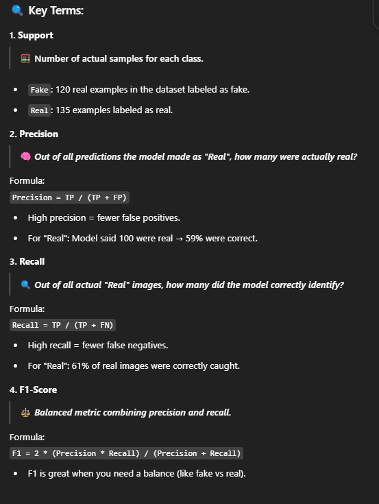

# 🧠 InVisionX - Deepfake Face Image Detection System

## 🚀 Project Overview

Deepfake images are becoming increasingly realistic and are widely used to spread misinformation and deceive people. Manual detection is nearly impossible, making it a growing digital threat.

**InVisionX** aims to tackle this issue using a **Convolutional Neural Network (CNN)**-based model. The system takes an image as input and provides a **confidence percentage** indicating how real or fake the image is.

With an intuitive interface and fast analysis, InVisionX empowers users to verify image authenticity and stay protected from visual manipulation.

---

## 🛠️ Tech Stack

- **Frontend:** HTML, CSS, JavaScript  
- **Frontend Framework:** Bootstrap  
- **Backend:** Python  
- **Backend Framework:** Flask  
- **Other Tools:** Visual Studio Code, GitHub Copilot  

---

## 💻 GUI Screenshots

**Index Page**  

**After Image Recognition and Analysis**  

---

## 📂 Project Structure and Code Explanation

### 📁 1. `index.py` - Model Training

#### 🔸 Data Management
- Loads datasets (training, validation, test) using `image_dataset_from_directory`.
- Resizes images to **128x128**, with a batch size of **32**.
- Applies optimizations like caching and prefetching.

#### 🔸 Data Augmentation
- Adds random flips and rotations to make the model more robust.

#### 🔸 CNN Architecture
- Rescaling (normalization)
- 3 Convolutional Layers (filters: 32, 64, 128)
- MaxPooling after each layer
- Flatten → Dense(128) with ReLU → Dropout(0.5) → Sigmoid Output (Binary Classification)

#### 🔸 Training
- Optimizer: **Adam**
- Loss: **Binary Crossentropy**
- Includes **EarlyStopping** and **ReduceLROnPlateau**
- Trains for up to **20 epochs**

#### 🔸 Evaluation
- Plots training/validation accuracy & loss
- Saves trained model as `face_classifier.keras`
- Visualizes predictions on test images

---

### 📁 2. `app.py` - Web Backend (Flask)

#### 🔸 Setup
- Loads the trained model
- CORS-enabled Flask app

#### 🔸 Image Preprocessing
- Converts to RGB
- Resizes to 128x128
- Normalizes and batches input

#### 🔸 Routes
- `/`: Serves the homepage
- `/predict`: Accepts an image, runs prediction, and returns:
  - **Prediction**: Real or Fake
  - **Confidence Level**

#### 🔸 Error Handling
- Checks for missing or invalid files
- Returns appropriate error messages

---

### 📁 3. `index.html` - Frontend UI

#### 🔸 Design
- Clean, modern look using Bootstrap
- Custom CSS for gradients and hover effects

#### 🔸 Features
- Drag-and-drop or browse image upload
- Display selected file
- Show prediction result with icon
- Highlights: Speed, Security, and AI-powered insights

#### 🔸 Functionality
- JavaScript handles async fetch requests to `/predict`
- Parses response and displays it dynamically
- Error handling for user input

---

## 🔍 Understanding Accuracy & Loss in InVisionX

During training, InVisionX tracks four key metrics:

### ✅ Accuracy
- **Training Accuracy**: How well the model fits the training data.
- **Validation Accuracy**: Key metric for generalization to unseen data.

### 📉 Loss
- **Training Loss**: Measures error on training data.
- **Validation Loss**: Indicates overfitting if it increases while training loss decreases.

### 🛡️ Optimization Techniques
- **EarlyStopping**: Stops training if validation loss doesn’t improve.
- **ModelCheckpoint**: Saves the best-performing model.

---

## 📊 Visual Results

**📈 Model Accuracy Output**  

**🧑‍🦰 Sample Faces & Prediction Output**  

**📉 Accuracy & Loss Graphs**  
  

---

## ✅ System Integration Summary

| Component | Role |
|----------|------|
| `index.py` | Trains the AI model |
| `app.py` | Hosts the prediction service |
| `index.html` | Enables user interaction |

ThankYou for giving us the Opportunity to learn and collaborate with most innovative minds of the Country.

